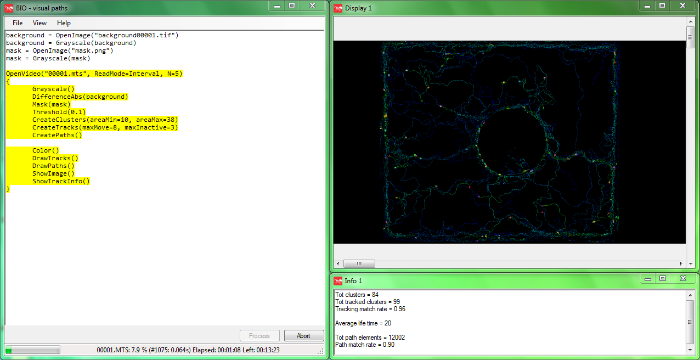

# BioImageOperation

## Introduction

BIO is a next generation image processing tool focusing on biological applications, balancing ease of use with desired flexibility required for research. This tool has been developed in collaboration with biologists, using extensive captured images. The solution balancing both the need for research purposes and flexibility required for this, and desired ease of use is realised in a script-based user interface. The tool uses the widely used OpenCV for many of its image operations, with an efficient tracking algorithm allowing real time processing.



## Quick start

BIO is operated using a scripting interface. Script files can be loaded and saved in the user interface.
BIO can also be executed from the command line like: BioImageOperation /path/to/script.bioscript
See Help & Links below for links to example scripts.

The starting operations for source images are:
- CreateImage	-   Create a blank image
- OpenImage	-   Open a single or series of images (any ffmpeg format)
- OpenVideo	-   Open a single or series of video files (any ffmpeg video format)
- OpenCapture	-   Open capturing from video (IP) path or camera source (#)
Series of images or videos should be labelled with a numeric format, wild-card pattern can be used (i.e. OpenImage(“image*.tif”) will read for example image0000.tif, image0001.tif, etc.)

General rules:
- Operations have an optional assignment e.g.: a = Grayscale()
- Any operation is on the current image, unless a source image label is used
- Any operation will replace the current image, unless an assignment is used
- A line can only support one operation (with an optional assignment)
- Use // for comments
- Preceding an operation with a number (x:Operation()) will only execute the operation once every x images
- Preceding an operation with 2 numbers (x-y:Operation()) will only execute the operation once every x images, on offset y

## Scripting step by step guide

### 1.	Sourcing
Source images or video(s)
```javascript
OpenVideo("ants_in_concrete.mov")
{
  ShowImage()
}
```
This operation will open the source video, and the open bracket (‘{‘) defines a set of inner operations that are executed within the brackets for each source image. ShowImage shows the current image in a image window.

### 2.	Pre-processing
This can include any operation to the image before background subtraction, commonly converting to grayscale
```javascript
OpenVideo("ants_in_concrete.mov")
{
  GrayScale()
  ShowImage()
}
```

### 3.	Background
This is split into two parts: first defining and/or updating a background image, and second to subtract it from the current image. A static background or dynamic background can be used.

### Static background
With a static background, a static background image will provide better results. Such background image can be produced in BIO using a separate script, gathering a total of at least 10 or 20 sample images across the source material. For example, if the source consists of 1000 images, an interval of 50 would produce 20 sample images. Example of a script to obtain a static background image using median:
```javascript
OpenVideo("ants_in_concrete.mov", Interval=50)
{
  GrayScale()
  AddSeries()
}
GetSeriesMedian()
SaveImage("background.png")
```

Back to the main script, this background image can be loaded before the OpenVideo loop:

```javascript
background = OpenImage("background.png")

OpenVideo("ants_in_concrete.mov")
{
  GrayScale()
  DifferenceAbs(background)
  
  ShowImage()
}
```

### Dynamic background
With a varying background (changing light intensity, movement etc), a dynamic background image can be used for better results. The frequency and weight of this update should be carefully tuned for best results.
```javascript
OpenVideo("ants_in_concrete.mov")
{
  GrayScale()
  5:background = UpdateBackground(Weight=0.05)
  DifferenceAbs(background)
  
  ShowImage()
}
```

### 4.	Threshold
The threshold function is used for two reasons. This will produce a binary image for cluster detection. The threshold value should be tuned for best results. Alternatively using the threshold function without value will use the Otsu method. However, setting a value normally gives better results.
```javascript
OpenVideo("ants_in_concrete.mov")
{
  GrayScale()
  5:background = UpdateBackground(Weight=0.05)
  DifferenceAbs(background)
  Threshold(0.1)
  
  ShowImage()
}
```

### 5.	Detection
Cluster detection is performed on binary images. This operation will generate a Tracker. Multiple Trackers can be defined and used, by using the Tracker=... operation argument. When this operation is used without parameters, the default Tracker is used and parameters are automatically defined using a basic statistical algorithm. The resulting parameters can be shown using `ShowTrackInfo()`.
```javascript
OpenVideo("ants_in_concrete.mov")
{
  GrayScale()
  5:background = UpdateBackground(Weight=0.05)
  DifferenceAbs(background)
  Threshold(0.1)
  
  CreateClusters()
  
  ShowTrackInfo()
  ShowImage()
}
```

These parameters can then be used in the corresponding operation. Suggested parameters should normally be tuned for best results, by visualising the detected clusters.
```javascript
OpenVideo("ants_in_concrete.mov")
{
  Grayscale()
  5:background = UpdateBackground(Weight=0.05)
  DifferenceAbs(background)
  Threshold(0.1)
  
  CreateClusters(MinArea=80, MaxArea=1000)
  
  DrawClusters()
  ShowImage()
}
```

### 6.	Tracking
Tracking is performed on an existing Tracker, which is created in the CreateClusters operation. When this operation is used without parameters, these are automatically defined using a basic statistical algorithm.
```javascript
OpenVideo("ants_in_concrete.mov")
{
  Grayscale()
  5:background = UpdateBackground(Weight=0.05)
  DifferenceAbs(background)
  Threshold(0.1)
	
  CreateClusters(MinArea=80, MaxArea=1000)
  CreateTracks()
  
  ShowTrackInfo()
  ShowImage()
}
```

These parameters can again be used in the corresponding operation. Suggested parameters should normally be tuned for best results, by visualising tracking. Tracks can be drawn on the current binary image, but to enable colors, a color image should be used. The current image can be converted to a color image.
```javascript
OpenVideo("ants_in_concrete.mov")
{
  Grayscale()
  5:background = UpdateBackground(Weight=0.05)
  DifferenceAbs(background)
  Threshold(0.1)
	
  CreateClusters(MinArea=80, MaxArea=1000)
  CreateTracks(MaxMove=20, MinActive=3, MaxInactive=3)
  
  Color()
  DrawTracks()
  ShowImage()
}
```

### 7.	Visualisation
As visualisation is an important element of providing insight, many options are available for this. This simple example shows the original image is used to draw tracks on.
```javascript
OpenVideo("ants_in_concrete.mov")
{
  StoreImage(original)
  Grayscale()
  5:background = UpdateBackground(Weight=0.05)
  DifferenceAbs(background)
  Threshold(0.1)
  
  CreateClusters(MinArea=80, MaxArea=1000)
  CreateTracks(MaxMove=20, MinActive=3, MaxInactive=3)
  
  GetImage(original)
  DrawTracks(DrawMode=Tracks|Angle|Label)
  ShowImage()
}
```

### 8.	Output
Like for sourcing images, many options are available for storing output as well. SaveVideo by default stores in h264 video encoding format. Note that the output operation is placed inside the source loop (OpenVideo). In this case, each image will be added as a new frame to the output video file.
```javascript
OpenVideo("ants_in_concrete.mov")
{
  StoreImage(original)
  Grayscale()
  5:background = UpdateBackground(Weight=0.05)
  DifferenceAbs(background)
  Threshold(0.1)
	
  CreateClusters(MinArea=80, MaxArea=1000)
  CreateTracks(MaxMove=20, MinActive=3, MaxInactive=3)
  
  GetImage(original)
  DrawTracks(DrawMode=Tracks|Angle|Label)
  ShowImage()

  SaveVideo("tracking.mp4")
}
```

## Links

- Script help in BioImageOperationScript document or command line: BioImageOperation -help
- [Script Manual](BioImageOperation%20script.md)
- Source code and script examples: github.com/folterj/BioImageOperation
- Binaries and version history: [joostdefolter.info](http://joostdefolter.info/ant-research)
- Discussion & Support at the community forum at [Image.sc forum](https://forum.image.sc) using the tag BioImageOperation
- Qt: ([qt.io](https://www.qt.io))
- OpenCV: ([opencv.org](https://opencv.org))
- Openh264: ([github.com/cisco/openh264](https://github.com/cisco/openh264))
