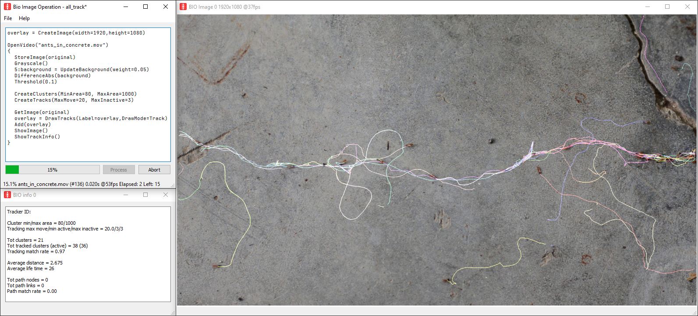

# BioImageOperation

Bio Image Operation or 'BIO', is a next generation Image processing tool focusing on biological applications, balancing ease of use with desired flexibility required for research.

This tool has been developed in collaboration with biologists, using extensive captured images.

The solution balancing both the need for research purposes and flexibility required for this, and desired ease of use is realised in a script based user interface.

The tool uses the widely used OpenCV for many of it's image operations, with an efficient tracking algorithm allowing real time processing.

This is a Microsoft Visual Studio 2019 / C++ CMake project

The project can either be opened as a Visual Studio project opening the solution file, or as a CMake project by opening the BioImageOperation root folder.

Requirements
- CMake ([cmake.org](https://cmake.org/)) / Visual Studio ([visualstudio.microsoft.com](https://visualstudio.microsoft.com/))
- Qt 5 ([qt.io](https://www.qt.io))
- OpenCV 4.4.0 ([opencv.org](https://opencv.org))
- Openh264 1.8.0 library ([github.com/cisco/openh264](https://github.com/cisco/openh264))

## Links

[User Manual](BioImageOperation%20manual.pdf)

[Script Manual](BioImageOperation%20script.pdf)

See [joostdefolter.info](http://joostdefolter.info/ant-research) for more info and binaries

For support and discussion, please use the [Image.sc forum](https://forum.image.sc) and post to the forum with the tag 'BioImageOperation'.
